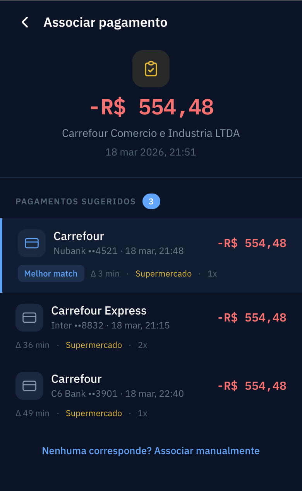
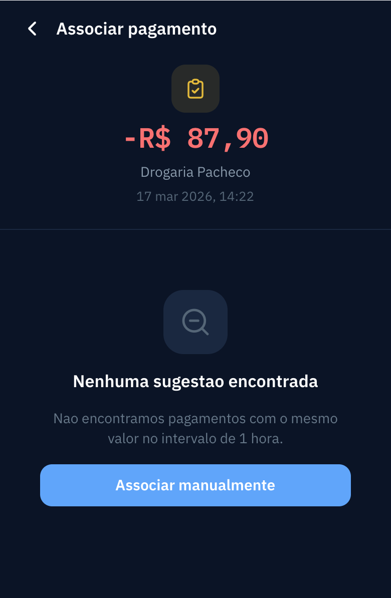

# PRD — Sugestao de Associacao Invoice ↔ Payment Notification

## Visao Geral

Quando um usuario escaneia uma nota fiscal e ela e cadastrada no sistema, nao existe hoje uma forma automatica de identificar qual notificacao de pagamento do cartao corresponde aquela nota. O usuario precisa fazer essa associacao manualmente, percorrendo uma lista de notificacoes.

Este PRD define:
1. **Backend** — endpoint que, dado um invoice, retorna automaticamente uma lista de `payment_notifications` candidatas a associacao, com base em valor exato e proximidade temporal (+-1 hora).
2. **Frontend** — tela de sugestoes no app Ionic/React (`controlai-frontend`) que consome o endpoint, exibe os candidatos e permite ao usuario selecionar uma sugestao ou ir para associacao manual com dados pre-preenchidos.

## Objetivos

- **Reduzir trabalho manual**: eliminar a necessidade de o usuario buscar manualmente a notificacao correspondente a uma nota fiscal escaneada.
- **Aumentar taxa de associacao**: facilitar o match entre invoices e payment_notifications, aumentando a porcentagem de notas associadas.
- **Resposta rapida**: o endpoint deve retornar resultados em menos de 500ms para nao impactar a experiencia do usuario no fluxo de escaneamento.
- **Dados em memoria**: manter os dados do invoice e da sugestao selecionada acessiveis no estado do app para que, ao navegar para associacao manual, os campos relevantes ja estejam pre-preenchidos (sem chamadas adicionais a API).

## Historias de Usuario

- **Como usuario do ControlAI**, eu quero que, apos escanear uma nota fiscal, o sistema me sugira automaticamente quais notificacoes de pagamento podem corresponder a ela, para que eu nao precise procurar manualmente.
- **Como usuario do ControlAI**, eu quero que as sugestoes sejam ordenadas pela mais provavel primeiro (menor diferenca de horario), para que eu consiga associar rapidamente.
- **Como usuario do ControlAI**, eu quero que notificacoes ja associadas a outros invoices nao aparecam nas sugestoes, para evitar associacoes duplicadas.
- **Como usuario do ControlAI**, eu quero que, ao clicar em "Associar manualmente", os dados do invoice (valor, data, estabelecimento) ja estejam pre-preenchidos na tela de associacao, para que eu nao precise digitar novamente.

## Design de Referencia

Os mockups estao no arquivo Paper "ControlAI" e foram exportados como imagens:

### Tela — Sugestoes com Resultados

**Elementos:**
- Header com back button e titulo "Associar pagamento"
- Resumo do invoice (icone, valor em destaque, nome do estabelecimento, data/hora)
- Divisor
- Section header "PAGAMENTOS SUGERIDOS" com badge de contagem
- Lista de cards de sugestao, cada um contendo:
  - Icone de cartao
  - Nome do estabelecimento + cartao (ultimos digitos) + data/hora
  - Valor a direita
  - Metadata: badge "Melhor match" (apenas no 1o), delta temporal (ex: "Δ 3 min"), categoria, parcelas
- A melhor sugestao (1a) tem borda azul lateral como destaque visual
- Link "Nenhuma corresponde? Associar manualmente" no rodape

### Tela — Estado Vazio (Nenhuma Sugestao)

**Elementos:**
- Mesmo header e resumo do invoice
- Ilustracao de busca vazia (icone de lupa)
- Titulo "Nenhuma sugestao encontrada"
- Texto explicativo "Nao encontramos pagamentos com o mesmo valor no intervalo de 1 hora."
- Botao primario "Associar manualmente" (azul, full-width)

---

## Funcionalidades Principais

### F1. Endpoint de Busca de Sugestoes (Backend)

O sistema deve expor um endpoint que recebe o identificador de um invoice e retorna uma lista de payment_notifications candidatas a associacao.

**Requisitos funcionais:**

1. **RF01** — O endpoint deve aceitar o identificador de um invoice e retornar uma lista de payment_notifications sugeridas.
2. **RF02** — A busca deve considerar apenas payment_notifications cujo valor (`amount`) seja exatamente igual ao total do invoice (`total`).
3. **RF03** — A busca deve considerar apenas payment_notifications cuja data de compra (`purchased_at`) esteja no intervalo de 1 hora antes ate 1 hora depois da data do invoice (`date`).
4. **RF04** — Payment_notifications que ja estejam associadas a outro invoice devem ser excluidas dos resultados.
5. **RF05** — Payment_notifications deletadas (`deleted_at IS NOT NULL`) ou canceladas (`cancelled_at IS NOT NULL`) devem ser excluidas dos resultados.
6. **RF06** — Os resultados devem ser ordenados por proximidade temporal: menor diferenca absoluta entre `purchased_at` e `date` do invoice aparece primeiro.
7. **RF07** — A resposta deve incluir para cada sugestao: identificador, ultimos digitos do cartao, data/hora da compra, valor, nome do estabelecimento, numero de parcelas, categoria, id da categoria, origem e tipo de origem.
8. **RF08** — Se o invoice informado nao existir, o endpoint deve retornar erro 404.
9. **RF09** — Se nao houver sugestoes, o endpoint deve retornar uma lista vazia (nao um erro).

### F2. Tela de Sugestoes (Frontend)

Nova pagina no app `controlai-frontend` que exibe as sugestoes retornadas pelo endpoint e permite ao usuario selecionar uma ou ir para associacao manual.

**Requisitos funcionais:**

10. **RF10** — A tela deve ser acessivel via rota `/purchase/invoice/:id/suggestions`.
11. **RF11** — Ao abrir, a tela deve carregar os dados do invoice (ja disponiveis em memoria via `PurchaseInvoiceDetail`) e chamar o endpoint de sugestoes.
12. **RF12** — Enquanto o endpoint responde, exibir skeleton loading nos cards de sugestao.
13. **RF13** — Se houver sugestoes, exibir a lista ordenada conforme design de referencia. A primeira sugestao deve ter destaque visual ("Melhor match" + borda azul).
14. **RF14** — Cada card de sugestao deve exibir: nome do estabelecimento, cartao (ultimos digitos), data/hora, valor, delta temporal em relacao ao invoice, categoria, numero de parcelas.
15. **RF15** — Se nao houver sugestoes, exibir o estado vazio conforme design de referencia.
16. **RF16** — Ao tocar em um card de sugestao, navegar para o fluxo de associacao (PRD futuro) passando via `location.state` os dados do invoice E da payment_notification selecionada.
17. **RF17** — Ao tocar em "Associar manualmente", navegar para o fluxo de associacao manual passando via `location.state` os dados do invoice (valor, data, id, estabelecimento) para pre-preenchimento.
18. **RF18** — O botao "Voltar" (<) deve retornar a tela anterior (`history.goBack()`).

### F3. Dados em Memoria para Pre-Preenchimento

**Requisito critico**: os dados relevantes devem ser passados em memoria (React Router `location.state`) para que, ao navegar para "Associar manualmente", a tela de destino ja tenha os dados pre-preenchidos sem precisar fazer novas chamadas a API.

**Requisitos funcionais:**

19. **RF19** — Ao navegar para a tela de sugestoes, os dados do invoice (`id`, `total`, `date`, `merchantName`) devem ser passados via `location.state` a partir da tela de origem (ex: `PurchaseDetail`).
20. **RF20** — Ao navegar de sugestoes para associacao manual, passar via `location.state`: `{ invoiceId, invoiceTotal, invoiceDate, invoiceMerchantName }`.
21. **RF21** — Ao navegar de sugestoes para associacao (com sugestao selecionada), passar via `location.state`: `{ invoiceId, invoiceTotal, invoiceDate, invoiceMerchantName, notificationId, notificationAmount, notificationMerchantName, notificationPurchasedAt, notificationCardLastDigits }`.
22. **RF22** — Se `location.state` nao contiver os dados do invoice (ex: acesso direto pela URL), a tela deve buscar os dados via API como fallback.

### F4. Ponto de Entrada na Tela de Detalhe do Invoice

23. **RF23** — Na tela `PurchaseDetail` (tipo `invoice`), adicionar um botao/link "Associar pagamento" que navega para `/purchase/invoice/:id/suggestions` passando os dados do invoice via `location.state`.
24. **RF24** — O botao deve aparecer apenas para invoices nao cancelados e nao associados.

## Experiencia do Usuario

### Fluxo Principal
1. Usuario abre detalhe de um invoice → ve botao "Associar pagamento"
2. Toca no botao → navega para tela de sugestoes com dados do invoice em memoria
3. Tela carrega sugestoes do endpoint → exibe lista rankeada
4. Usuario toca na sugestao mais provavel → navega para tela de associacao com dados pre-preenchidos (invoice + notification)

### Fluxo Alternativo — Associacao Manual
1. Mesmos passos 1-3
2. Nenhuma sugestao corresponde → usuario toca "Associar manualmente"
3. Navega para tela de associacao manual com dados do invoice pre-preenchidos

### Fluxo Alternativo — Sem Sugestoes
1. Mesmos passos 1-2
2. Endpoint retorna lista vazia → exibe estado vazio
3. Usuario toca "Associar manualmente" → mesma navegacao com dados pre-preenchidos

## Restricoes Tecnicas de Alto Nivel

### Backend
- **Latencia**: resposta em menos de 500ms.
- **Indices**: a busca por valor + intervalo temporal deve ser performatica; indices adequados nas colunas `amount` e `purchased_at` de `payment_notifications` devem existir.
- **Arquitetura existente**: o endpoint deve seguir o padrao ja estabelecido no projeto (Controller -> UseCase -> Provider -> Repository).
- **Banco de dados**: MySQL 8.0 com Flyway migrations.
- **Entidades envolvidas**:
  - `purchase_invoices` — campos relevantes: `total` (DECIMAL 10,2), `date` (DATETIME).
  - `payment_notifications` — campos relevantes: `amount` (DECIMAL 19,2), `purchased_at` (TIMESTAMP), `deleted_at`, `cancelled_at`.
- **Associacao 1:1**: uma payment_notification so pode estar associada a um unico invoice.

### Frontend
- **Stack**: Ionic React 8 + Capacitor + React Router v5 + TypeScript
- **Projeto**: `controlai-frontend` em `/Volumes/SSD480GB/projects/controlai-frontend`
- **Padroes existentes**:
  - Paginas seguem `IonPage > IonContent > div.ctrl-wrapper` pattern
  - Navegacao: `useHistory()` + `useParams()` do react-router-dom v5
  - API calls: `httpRequest<T>(method, path, body?)` via Capacitor HTTP (nativo) ou fetch (web)
  - CSS: arquivos `.css` por pagina/componente, classes com prefixo `ctrl-` e `pd-` (PurchaseDetail)
  - Dark mode: ativo via Ionic CSS palettes
- **Novo service function**: `getInvoiceSuggestions(invoiceId: number): Promise<SuggestionResponse[]>` em `purchaseService.ts`
- **Nova rota**: `/purchase/invoice/:id/suggestions` no `App.tsx`
- **Novos arquivos**:
  - `src/pages/SuggestionsPage.tsx`
  - `src/pages/SuggestionsPage.css`

## Fora de Escopo

- **Endpoint de associacao** (vincular invoice a payment_notification selecionada) — sera definido em PRD separado.
- **Migration de banco** (coluna de associacao em `purchase_invoices`) — sera definida junto ao PRD de associacao.
- **Tela de associacao manual** — sera definida em PRD separado. Este PRD apenas define o contrato de navegacao (`location.state`) para pre-preenchimento.
- **Matching por nome do estabelecimento** (fuzzy matching) — pode ser adicionado futuramente.
- **Matching por valor aproximado** (tolerancia) — por ora, apenas valor exato.
- **Notificacao push** ao usuario sobre sugestoes encontradas.
- **Fluxo assincrono** (fila + listener) — ja existe e esta fora do escopo deste PRD.
